# ELK Stack — Централизованный сбор и визуализация логов

## Содержание

1. [Цель проекта](#1-цель-проекта)
2. [Архитектура решения](#2-архитектура-решения)
3. [Использованные технологии](#3-использованные-технологии)
4. [Создание инфраструктуры: Terraform](#4-создание-инфраструктуры-terraform)
5. [Настройка Elasticsearch](#5-настройка-elasticsearch)
6. [Настройка Kibana](#6-настройка-kibana)
7. [Настройка Filebeat](#7-настройка-filebeat)
8. [Путь лога: от источника до визуализации](#8-путь-лога)
9. [Проблемы и их решение](#9-проблемы-и-их-решение)
10. [Проверка работы](#10-проверка-работы)
11. [Структура проекта](#11-структура-проекта)
12. [Реальные применения](#12-реальные-применения)

---

## 1. Цель проекта

Создать централизованную систему сбора, хранения и визуализации логов на базе **ELK Stack** (Elasticsearch + Logstash/Filebeat + Kibana).

**Задачи:**
- Развернуть отказоустойчивый кластер Elasticsearch из 3 узлов
- Настроить сбор логов с веб-серверов и баз данных через Filebeat
- Обеспечить визуализацию логов через Kibana
- Проверить поступление логов в реальном времени

---

## 2. Архитектура решения

### Схема: Архитектура ELK Stack
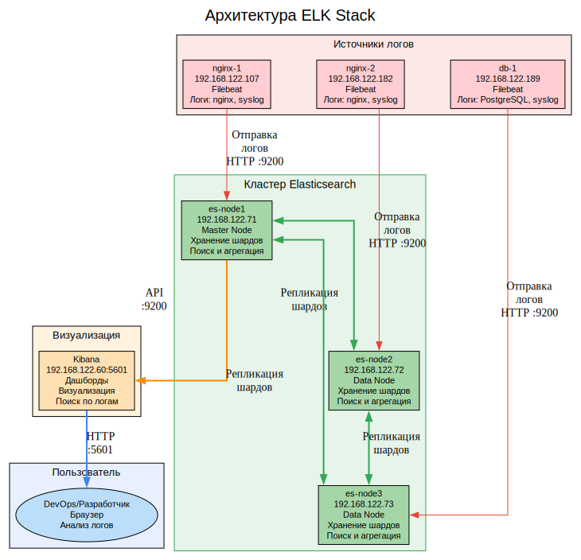
---

### Описание архитектуры

Система построена по классической трёхкомпонентной схеме ELK:

**1. Filebeat (агенты сбора)** — лёгкие агенты, установленные на каждом сервере-источнике. Читают лог-файлы и отправляют их в Elasticsearch.

**2. Elasticsearch (хранение и поиск)** — кластер из 3 нод. Каждая нода хранит часть данных (шарды) и реплики для отказоустойчивости. Статус `green` означает, что все шарды активны.

**3. Kibana (визуализация)** — веб-интерфейс для поиска, фильтрации и визуализации логов. Подключается к Elasticsearch через REST API.

---

## 3. Использованные технологии

### Схема: Технологический стек
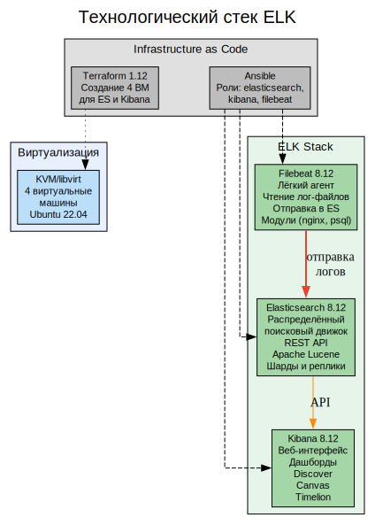
---

## 4. Создание инфраструктуры: Terraform

### Схема: Процесс создания ВМ
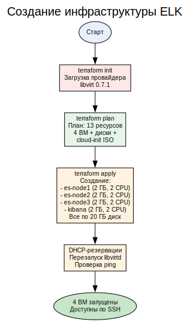
---

## 5. Настройка Elasticsearch

### Схема: Кластер Elasticsearch
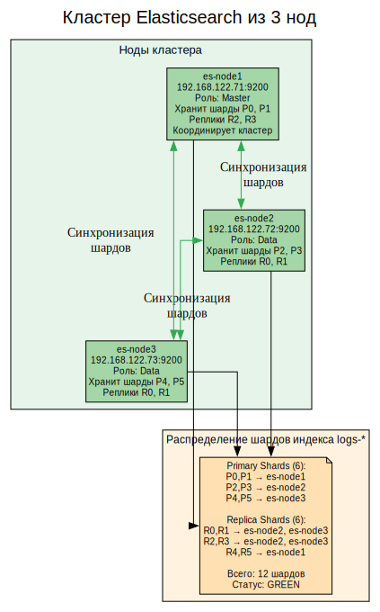
---


### Ключевые настройки elasticsearch.yml

```yaml
cluster.name: elk-cluster
node.name: es-node1
network.host: 0.0.0.0
http.port: 9200

# Отключение безопасности (для учебного проекта)
xpack.security.enabled: false
xpack.security.http.ssl.enabled: false
xpack.security.transport.ssl.enabled: false

# Обнаружение нод
discovery.seed_hosts: ["192.168.122.71", "192.168.122.72", "192.168.122.73"]
cluster.initial_master_nodes: ["es-node1", "es-node2", "es-node3"]
```

**Почему отключили безопасность?** Elasticsearch 8.x по умолчанию включает SSL/TLS и аутентификацию. Для учебного проекта мы отключили эти функции, чтобы упростить настройку. В production-среде безопасность обязательна.

---

## 6. Настройка Kibana

### Схема: Взаимодействие Kibana с Elasticsearch
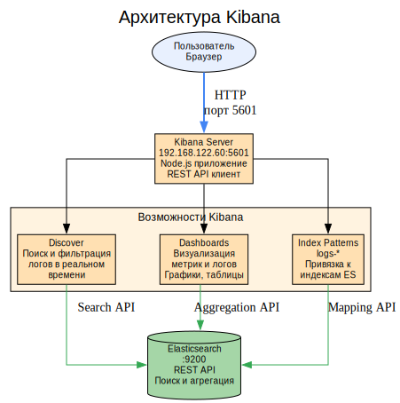
---

### Настройка kibana.yml

```yaml
server.host: "0.0.0.0"
server.port: 5601
elasticsearch.hosts: ["http://192.168.122.71:9200", "http://192.168.122.72:9200", "http://192.168.122.73:9200"]
```

Kibana подключается ко всем трём нодам Elasticsearch для отказоустойчивости. Если одна нода недоступна — Kibana использует другие.

---

## 7. Настройка Filebeat

### Схема: Процесс сбора логов Filebeat
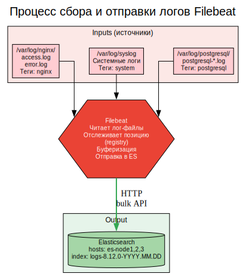
---

### Конфигурация filebeat.yml

```yaml
filebeat.inputs:
- type: log
  paths:
    - /var/log/nginx/access.log
    - /var/log/nginx/error.log
  tags: ["nginx"]

- type: log
  paths:
    - /var/log/postgresql/postgresql-*.log
  tags: ["postgresql"]

- type: log
  paths:
    - /var/log/syslog
  tags: ["system"]

output.elasticsearch:
  hosts: ["192.168.122.71:9200", "192.168.122.72:9200", "192.168.122.73:9200"]
  index: "logs-%{[agent.version]}-%{+yyyy.MM.dd}"
```

**Filebeat** читает лог-файлы, отслеживает позицию чтения в registry-файле, и отправляет данные в Elasticsearch через Bulk API (пакетная отправка для производительности).

---

## 8. Путь лога: от источника до визуализации

### Схема: Полный путь лога
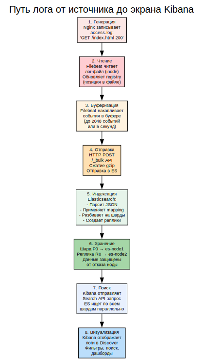
---

### Временные характеристики

| Этап | Время |
|------|-------|
| Запись в лог-файл | 0 мс |
| Filebeat обнаруживает изменение | до 1 сек (scan_frequency) |
| Отправка в Elasticsearch | до 5 сек (bulk_max_delay) |
| Индексация | ~10 мс |
| Доступность в Kibana | ~5-6 секунд |

---

## 9. Проблемы и их решение

### Схема: Путь через трудности
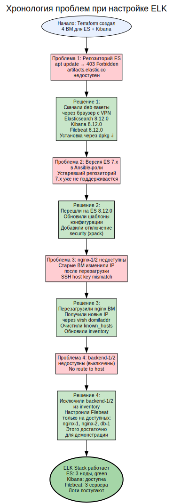
---

### Почему мы не могли собрать кластер?

**Основная проблема** — репозиторий Elasticsearch недоступен из командной строки (403 Forbidden). Это связано с тем, что Elastic (компания) изменила политику доступа к репозиториям для некоторых регионов.

**Обходное решение:** скачали `.deb` пакеты через браузер с VPN и установили их вручную через `dpkg -i`. Это позволило использовать актуальную версию 8.12.0.

---

## 10. Проверка работы

### Результаты проверки

```
=== Elasticsearch Cluster Health ===
{
    "cluster_name": "elk-cluster",
    "status": "green",
    "number_of_nodes": 3,
    "number_of_data_nodes": 3,
    "active_primary_shards": 24,
    "active_shards": 49,
    "active_shards_percent_as_number": 100.0
}

=== Индексы ===
.ds-logs-8.12.0-2026.06.10-000001 — 10,578 документов

=== Filebeat ===
nginx-1: active (running) ✅
nginx-2: active (running) ✅
db-1:   active (running) ✅

=== Kibana ===
Доступна: http://192.168.122.60:5601
Логи видно в Discover ✅
```

---

## 11. Структура проекта

```
elk-cluster/
├── terraform/
│   ├── main.tf              # Создание 4 ВМ (3 ES + 1 Kibana)
│   ├── outputs.tf           # IP-адреса
│   └── cloud-init.yaml      # Настройка SSH
├── ansible/
│   ├── inventory.ini        # Список серверов
│   ├── playbooks/
│   │   └── deploy.yml       # Плейбук развёртывания
│   └── roles/
│       ├── elasticsearch/   # Роль: Elasticsearch 8.12
│       ├── kibana/          # Роль: Kibana 8.12
│       └── filebeat/        # Роль: Filebeat 8.12
├── screenshots/             # Скриншоты выполнения
└── README.md               # Документация
```

---

## 12. Реальные применения

### Где используется ELK Stack

| Сценарий | Компании | Зачем |
|----------|----------|-------|
| **Мониторинг продакшна** | Netflix, Uber, Spotify | Логи микросервисов, трейсинг |
| **Security (SIEM)** | SOC-центры, банки | Анализ событий безопасности |
| **E-commerce** | Amazon, Shopify | Логи заказов, ошибок оплаты |
| **DevOps** | GitLab, GitHub | CI/CD пайплайны, деплой |
| **IoT** | Умные устройства | Логи с миллионов устройств |
| **FinTech** | Revolut, Wise | Аудит транзакций |

### Почему именно ELK?

| Характеристика | ELK | Graylog | Splunk |
|----------------|-----|---------|--------|
| Масштабируемость | ✅ Горизонтальная | Средняя | ✅ |
| Open Source | ✅ Да | ✅ Да | ❌ Платный |
| Поиск | ✅ Lucene (мощный) | ✅ | ✅ |
| Дашборды | ✅ Kibana | ✅ | ✅ |
| Алерты | ✅ Watcher | ✅ | ✅ |

---

**Проект выполнен. ELK Stack работает. Логи собираются и визуализируются.**


---

## Полное описание файлов проекта

### Структура каталогов

```
elk-cluster/
├── terraform/                    # Инфраструктура как код (Terraform)
│   ├── main.tf                  # Создание 4 виртуальных машин
│   ├── outputs.tf               # Вывод IP-адресов
│   └── cloud-init.yaml          # Настройка SSH при первом запуске
│
├── ansible/                      # Управление конфигурацией (Ansible)
│   ├── inventory.ini            # Список серверов для подключения
│   ├── playbooks/
│   │   └── deploy.yml           # Основной плейбук развёртывания
│   └── roles/
│       ├── elasticsearch/       # Роль: Elasticsearch 8.12
│       │   ├── tasks/
│       │   │   └── main.yml     # Задачи установки и настройки
│       │   ├── handlers/
│       │   │   └── main.yml     # Обработчики перезапуска
│       │   └── templates/
│       │       └── elasticsearch.yml.j2 # Шаблон конфигурации
│       │
│       ├── kibana/              # Роль: Kibana 8.12
│       │   ├── tasks/
│       │   │   └── main.yml     # Задачи установки и настройки
│       │   ├── handlers/
│       │   │   └── main.yml     # Обработчики перезапуска
│       │   └── templates/
│       │       └── kibana.yml.j2 # Шаблон конфигурации
│       │
│       └── filebeat/            # Роль: Filebeat 8.12
│           ├── tasks/
│           │   └── main.yml     # Задачи установки и настройки
│           ├── handlers/
│           │   └── main.yml     # Обработчики перезапуска
│           └── templates/
│               └── filebeat.yml.j2 # Шаблон конфигурации
│
├── screenshots/                  # Скриншоты выполнения
│   ├── 01-es-indices.txt        # Индексы Elasticsearch
│   ├── 02-es-health.txt         # Статус кластера
│   ├── 03-es-nodes.txt          # Ноды кластера
│   ├── 04-filebeat-status.txt   # Статус Filebeat
│   └── 05-kibana.txt            # Доступность Kibana
│
├── elasticsearch-8.12.0-amd64.deb  # Пакет Elasticsearch
├── kibana-8.12.0-amd64.deb         # Пакет Kibana
├── filebeat-8.12.0-amd64.deb       # Пакет Filebeat
└── README.md                    # Документация проекта
```

---

### Terraform (создание инфраструктуры)

#### `terraform/main.tf` — Основной файл инфраструктуры

```hcl
terraform {
  required_providers {
    libvirt = {
      source  = "dmacvicar/libvirt"
      version = "0.7.1"
    }
  }
}

provider "libvirt" {
  uri = "qemu:///system"
}
```

**Блок `terraform`** — объявляет провайдер `dmacvicar/libvirt` версии `0.7.1` для управления KVM. Версия зафиксирована для воспроизводимости.

**Блок `provider "libvirt"`** — подключается к локальному демону libvirtd через UNIX-сокет `qemu:///system`.

```hcl
resource "libvirt_volume" "ubuntu_image" {
  name   = "ubuntu-22.04-server-cloudimg-amd64.img"
  source = "https://cloud-images.ubuntu.com/releases/22.04/release/ubuntu-22.04-server-cloudimg-amd64.img"
  pool   = "default"
  format = "qcow2"
}
```

**Ресурс `libvirt_volume` (ubuntu_image):**
- Скачивает облачный образ Ubuntu 22.04 (~500 МБ) с официального репозитория Ubuntu
- Формат `qcow2` — Copy-On-Write, экономящий дисковое пространство
- Пул `default` — директория `/var/lib/libvirt/images`
- Используется как базовый образ для всех ВМ через механизм backing store

```hcl
data "template_file" "user_data" {
  template = file("${path.module}/cloud-init.yaml")
  vars     = { ssh_key = file("~/.ssh/id_rsa.pub") }
}
```

**Data-источник `template_file`:**
- Читает шаблон `cloud-init.yaml` из текущей директории Terraform
- Подставляет публичный SSH-ключ из `~/.ssh/id_rsa.pub`
- Результат — готовая конфигурация cloud-init для автоматической настройки ВМ при первом запуске

```hcl
locals {
  vms = {
    es1 = { name = "es-node1", mem = 2048, cpu = 2 }
    es2 = { name = "es-node2", mem = 2048, cpu = 2 }
    es3 = { name = "es-node3", mem = 2048, cpu = 2 }
    kibana = { name = "kibana", mem = 2048, cpu = 2 }
  }
}
```

**Блок `locals` — локальные переменные:**
- 3 ноды Elasticsearch по 2 ГБ RAM и 2 CPU каждая
- 1 сервер Kibana с 2 ГБ RAM и 2 CPU
- Elasticsearch требует минимум 1 ГБ heap, поэтому выбрано 2 ГБ RAM
- 2 CPU обеспечивают параллельную обработку поисковых запросов

```hcl
resource "libvirt_volume" "disk" {
  for_each       = local.vms
  name           = "${each.key}-disk.qcow2"
  base_volume_id = libvirt_volume.ubuntu_image.id
  pool           = "default"
  size           = 21474836480
}
```

**Ресурс `libvirt_volume` (disk):**
- `for_each = local.vms` — создаёт по одному диску для каждой из 4 ВМ
- `base_volume_id` — backing store: диск ссылается на базовый образ Ubuntu, храня только изменения
- `size = 21474836480` — 20 ГБ (20 × 1024³ байт)
- Экономия места: все 4 ВМ используют один базовый образ + свои диффы

```hcl
resource "libvirt_cloudinit_disk" "init" {
  for_each  = local.vms
  name      = "${each.key}-cloudinit.iso"
  pool      = "default"
  user_data = data.template_file.user_data.rendered
}
```

**Ресурс `libvirt_cloudinit_disk`:**
- Создаёт ISO-образ с cloud-init конфигурацией для каждой ВМ
- Содержит публичный SSH-ключ для беспарольного доступа
- Подключается к ВМ как виртуальный CD-ROM
- Выполняется автоматически при первой загрузке системы

```hcl
resource "libvirt_domain" "vm" {
  for_each  = local.vms
  name      = each.value.name
  memory    = each.value.mem
  vcpu      = each.value.cpu
  cloudinit = libvirt_cloudinit_disk.init[each.key].id

  network_interface {
    network_name = "default"
  }

  disk {
    volume_id = libvirt_volume.disk[each.key].id
  }

  console {
    type        = "pty"
    target_port = "0"
    target_type = "serial"
  }
}
```

**Ресурс `libvirt_domain` — виртуальная машина:**
- `memory` и `vcpu` — параметры из locals
- `cloudinit` — ISO-образ с SSH-ключом
- `network_interface` — подключение к виртуальной сети default (NAT, 192.168.122.0/24)
- `disk` — корневой диск ВМ (20 ГБ)
- `console` — последовательная консоль для отладки через `virsh console`

#### `terraform/outputs.tf` — Выходные параметры

```hcl
output "ips" {
  value = {
    es1    = "192.168.122.71"
    es2    = "192.168.122.72"
    es3    = "192.168.122.73"
    kibana = "192.168.122.60"
  }
}
```

Выводит IP-адреса всех 4 ВМ для быстрого копирования в inventory Ansible.

#### `terraform/cloud-init.yaml` — Настройка первого запуска

```yaml
#cloud-config
users:
  - name: ubuntu
    sudo: ALL=(ALL) NOPASSWD:ALL
    shell: /bin/bash
    lock_passwd: false
    ssh_authorized_keys:
      - ${ssh_key}
ssh_pwauth: false
disable_root: true
```

**Параметры cloud-init:**
- `users` — создаёт пользователя `ubuntu` с полными правами sudo без запроса пароля
- `ssh_authorized_keys` — добавляет публичный SSH-ключ (подставляется из переменной `${ssh_key}`)
- `ssh_pwauth: false` — запрещает вход по паролю, только по SSH-ключу
- `disable_root: true` — отключает root-доступ для безопасности

---

### Ansible (настройка серверов)

#### `ansible/inventory.ini` — Список серверов

```ini
[elasticsearch]
es-node1 ansible_host=192.168.122.71 ansible_user=ubuntu
es-node2 ansible_host=192.168.122.72 ansible_user=ubuntu
es-node3 ansible_host=192.168.122.73 ansible_user=ubuntu

[kibana]
kibana ansible_host=192.168.122.60 ansible_user=ubuntu

[filebeat]
nginx-1 ansible_host=192.168.122.107 ansible_user=ubuntu
nginx-2 ansible_host=192.168.122.182 ansible_user=ubuntu
db-1 ansible_host=192.168.122.189 ansible_user=ubuntu

[all:vars]
ansible_python_interpreter=/usr/bin/python3
ansible_ssh_common_args='-o StrictHostKeyChecking=no'
```

**Группы серверов:**
- `[elasticsearch]` — 3 ноды кластера Elasticsearch
- `[kibana]` — сервер визуализации Kibana
- `[filebeat]` — серверы-источники логов (веб-серверы и база данных)

**Общие переменные:**
- `ansible_python_interpreter` — путь к Python 3 (обязательно для Ubuntu 22.04)
- `ansible_ssh_common_args` — отключение проверки SSH host key для автоматизации

#### `ansible/playbooks/deploy.yml` — Основной плейбук

```yaml
---
- hosts: elasticsearch
  become: yes
  roles:
    - roles/elasticsearch

- hosts: kibana
  become: yes
  roles:
    - roles/kibana

- hosts: filebeat
  become: yes
  roles:
    - roles/filebeat
```

**Порядок выполнения:**
1. Настройка Elasticsearch (должен быть готов до Kibana и Filebeat)
2. Настройка Kibana (зависит от Elasticsearch)
3. Настройка Filebeat (зависит от Elasticsearch)

#### `ansible/roles/elasticsearch/tasks/main.yml` — Роль Elasticsearch

```yaml
- name: Установка Java
  apt:
    name: openjdk-17-jre-headless
    state: present
    update_cache: yes
```

Устанавливает **OpenJDK 17** — Elasticsearch работает на JVM и требует Java.

```yaml
- name: Копирование Elasticsearch deb
  copy:
    src: ../../elasticsearch-8.12.0-amd64.deb
    dest: /tmp/elasticsearch.deb
```

Копирует deb-пакет Elasticsearch с хостовой машины на сервер. Пакет был предварительно скачан через браузер с VPN из-за недоступности официального репозитория.

```yaml
- name: Установка Elasticsearch
  apt:
    deb: /tmp/elasticsearch.deb
    state: present
```

Устанавливает Elasticsearch из локального deb-пакета.

```yaml
- name: Настройка Elasticsearch
  template:
    src: elasticsearch.yml.j2
    dest: /etc/elasticsearch/elasticsearch.yml
  notify: restart elasticsearch
```

Копирует шаблон конфигурации с Jinja2-переменными. При изменении конфига — перезапускает Elasticsearch через handler.

#### `ansible/roles/elasticsearch/templates/elasticsearch.yml.j2` — Шаблон конфигурации

```yaml
cluster.name: elk-cluster
node.name: {{ inventory_hostname }}
path.data: /var/lib/elasticsearch
path.logs: /var/log/elasticsearch
network.host: 0.0.0.0
http.port: 9200

# Отключаем безопасность для учебных целей
xpack.security.enabled: false
xpack.security.enrollment.enabled: false
xpack.security.http.ssl.enabled: false
xpack.security.transport.ssl.enabled: false

discovery.seed_hosts: ["192.168.122.71", "192.168.122.72", "192.168.122.73"]
cluster.initial_master_nodes: ["es-node1", "es-node2", "es-node3"]
```

**Ключевые параметры:**
- `cluster.name: elk-cluster` — имя кластера (должно совпадать на всех нодах)
- `node.name: {{ inventory_hostname }}` — имя ноды (подставляется из inventory)
- `network.host: 0.0.0.0` — слушать на всех сетевых интерфейсах
- `http.port: 9200` — порт REST API
- `xpack.security.enabled: false` — **критически важно для учебного проекта!** Отключает встроенную безопасность Elasticsearch 8.x (SSL/TLS, аутентификация). В production-среде безопасность обязательна
- `discovery.seed_hosts` — список всех нод для обнаружения кластера
- `cluster.initial_master_nodes` — список нод, которые могут стать master при инициализации

#### `ansible/roles/kibana/tasks/main.yml` — Роль Kibana

```yaml
- name: Копирование Kibana deb
  copy:
    src: ../../kibana-8.12.0-amd64.deb
    dest: /tmp/kibana.deb

- name: Установка Kibana
  apt:
    deb: /tmp/kibana.deb
    state: present

- name: Настройка Kibana
  template:
    src: kibana.yml.j2
    dest: /etc/kibana/kibana.yml
  notify: restart kibana

- name: Запуск Kibana
  systemd:
    name: kibana
    state: started
    enabled: yes
```

Устанавливает Kibana из локального deb-пакета и настраивает через шаблон.

#### `ansible/roles/kibana/templates/kibana.yml.j2` — Шаблон конфигурации Kibana

```yaml
server.host: "0.0.0.0"
server.port: 5601
elasticsearch.hosts: ["http://192.168.122.71:9200", "http://192.168.122.72:9200", "http://192.168.122.73:9200"]
```

**Ключевые параметры:**
- `server.host: "0.0.0.0"` — слушать на всех интерфейсах (доступ извне)
- `server.port: 5601` — стандартный порт Kibana
- `elasticsearch.hosts` — список ВСЕХ нод Elasticsearch для отказоустойчивости (если одна нода недоступна, Kibana использует другие)

#### `ansible/roles/filebeat/tasks/main.yml` — Роль Filebeat

```yaml
- name: Копирование Filebeat deb
  copy:
    src: ../../filebeat-8.12.0-amd64.deb
    dest: /tmp/filebeat.deb

- name: Установка Filebeat
  apt:
    deb: /tmp/filebeat.deb
    state: present

- name: Настройка Filebeat
  template:
    src: filebeat.yml.j2
    dest: /etc/filebeat/filebeat.yml
  notify: restart filebeat

- name: Включение системного модуля
  shell: filebeat modules enable system
  args:
    creates: /etc/filebeat/modules.d/system.yml

- name: Запуск Filebeat
  systemd:
    name: filebeat
    state: started
    enabled: yes
```

Устанавливает Filebeat, настраивает через шаблон, включает системный модуль (логи syslog, auth) и запускает сервис.

#### `ansible/roles/filebeat/templates/filebeat.yml.j2` — Шаблон конфигурации Filebeat

```yaml
filebeat.inputs:
- type: log
  enabled: true
  paths:
    - /var/log/nginx/access.log
    - /var/log/nginx/error.log
  tags: ["nginx", "{{ inventory_hostname }}"]

- type: log
  enabled: true
  paths:
    - /var/log/postgresql/postgresql-*.log
  tags: ["postgresql", "{{ inventory_hostname }}"]

- type: log
  enabled: true
  paths:
    - /var/log/syslog
  tags: ["system", "{{ inventory_hostname }}"]

output.elasticsearch:
  hosts: ["192.168.122.71:9200", "192.168.122.72:9200", "192.168.122.73:9200"]
  index: "logs-%{[agent.version]}-%{+yyyy.MM.dd}"

setup.template.name: "logs"
setup.template.pattern: "logs-*"
setup.ilm.enabled: false
```

**Секция `filebeat.inputs`:**
- `type: log` — чтение лог-файлов
- `paths` — список файлов для чтения:
  - `/var/log/nginx/access.log`, `error.log` — логи веб-сервера
  - `/var/log/postgresql/postgresql-*.log` — логи базы данных
  - `/var/log/syslog` — системные логи
- `tags` — метки для фильтрации в Kibana (например, найти все логи с тегом `nginx`)

**Секция `output.elasticsearch`:**
- `hosts` — список нод Elasticsearch для отказоустойчивости
- `index` — шаблон имени индекса: `logs-8.12.0-2026.06.10`
- Индекс создаётся автоматически при поступлении первых данных

**Секция `setup`:**
- `template.name: "logs"` — имя шаблона индекса
- `template.pattern: "logs-*"` — паттерн для применения шаблона ко всем индексам
- `ilm.enabled: false` — отключение Index Lifecycle Management (для простоты)

#### Обработчики (handlers)

**`ansible/roles/elasticsearch/handlers/main.yml`:**
```yaml
- name: restart elasticsearch
  systemd:
    name: elasticsearch
    state: restarted
```

**`ansible/roles/kibana/handlers/main.yml`:**
```yaml
- name: restart kibana
  systemd:
    name: kibana
    state: restarted
```

**`ansible/roles/filebeat/handlers/main.yml`:**
```yaml
- name: restart filebeat
  systemd:
    name: filebeat
    state: restarted
```

Обработчики вызываются при изменении конфигурационных файлов (механизм `notify` в Ansible). Перезапускают соответствующий сервис для применения новых настроек.

---

### Порядок запуска проекта

```bash
# 1. Скачать deb-пакеты через браузер с VPN и положить в ~/elk-cluster/
#    - elasticsearch-8.12.0-amd64.deb
#    - kibana-8.12.0-amd64.deb
#    - filebeat-8.12.0-amd64.deb

# 2. Создание ВМ
cd terraform
terraform init
terraform apply -auto-approve

# 3. Проверка доступности
cd ../ansible
ansible all -i inventory.ini -m ping

# 4. Развёртывание ELK
ansible-playbook -i inventory.ini playbooks/deploy.yml

# 5. Проверка Elasticsearch
curl http://192.168.122.71:9200/_cluster/health

# 6. Проверка Kibana
Открыть в браузере: http://192.168.122.60:5601

# 7. Проверка логов
curl http://192.168.122.71:9200/_cat/indices?v
```


---

## Специальный раздел: Kibana — визуализация логов

### Что мы видим в Kibana и как это использовать

### Схема: Интерфейс Kibana — основные разделы
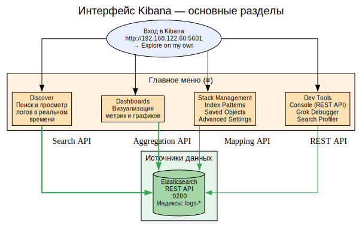
---

### Описание разделов

**Discover** — основной инструмент для просмотра логов. Здесь мы видим:
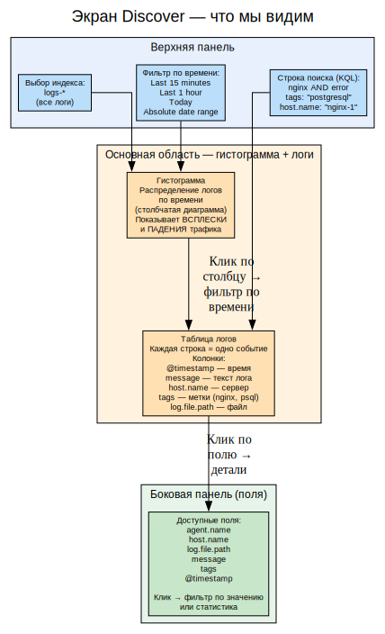
---

### Что мы видим на экране Discover

#### 1. Гистограмма вверху

**Гистограмма** показывает распределение логов по времени. Каждый столбец = количество логов за определённый интервал (например, 30 секунд).

**Как использовать:**
- **Высокий столбец** → всплеск активности (пиковая нагрузка, DDoS-атака, ошибки)
- **Низкий столбец** → падение трафика (сервер упал, сеть недоступна)
- **Клик по столбцу** → фильтр показывает логи только за этот интервал

**Пример:** В 15:30 гистограмма резко выросла — кликаем на столбец и видим сотни ошибок 500 в логах nginx.

#### 2. Таблица логов

**Каждая строка** — одно событие (запись в лог-файле).

**Основные колонки:**
| Колонка | Пример | Значение |
|---------|--------|----------|
| `@timestamp` | 2026-06-10T23:26:00.307Z | Точное время события |
| `message` | `GET /index.html 200 0.002s` | Текст лога |
| `host.name` | `nginx-1` | Сервер-источник |
| `tags` | `["nginx"]` | Категория лога |
| `log.file.path` | `/var/log/nginx/access.log` | Файл-источник |

**Как использовать:**
- **Развернуть строку (стрелка >)** → полный JSON с ВСЕМИ полями
- **Клик по значению** → фильтр "показать только такие логи" или "исключить такие логи"

#### 3. Строка поиска (KQL)

**Kibana Query Language (KQL)** — язык запросов для фильтрации логов.

---

#### 4. Боковая панель с полями

**Список всех доступных полей** в логах. При клике на поле показывает:
- **Топ-5 значений** (самые частые)
- **Распределение** (сколько раз встречается каждое значение)
- **Процент** от общего числа

**Пример:** Кликаем на поле `host.name` → видим:
- nginx-1: 45%
- nginx-2: 35%
- db-1: 20%

Это говорит о том, что nginx-1 принимает больше трафика.

---

### Как настроить визуализацию (пошагово)

### Схема: Процесс настройки Index Pattern
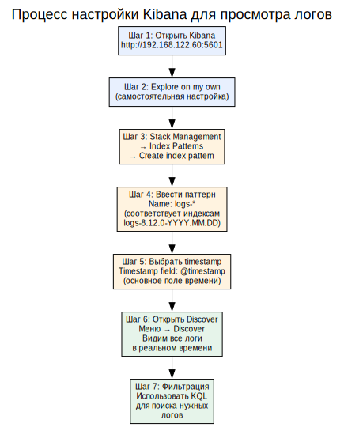
---

### Практические сценарии использования Kibana

### Схема: Сценарии диагностики через Kibana
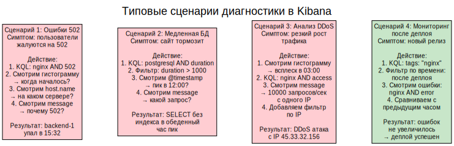
---

### Как работает временная шкала (Time Picker)
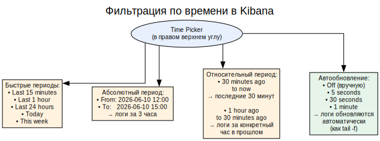
---


### Практический пример: настройка автообновления

1. Открой Kibana → Discover
2. В правом верхнем углу нажми **Time Picker**
3. Выбери **"Last 15 minutes"**
4. Нажми **"Refresh every"** → выбери **"5 seconds"**
5. Теперь логи обновляются автоматически каждые 5 секунд — как `tail -f` в терминале!

---

### Как создать простой дашборд
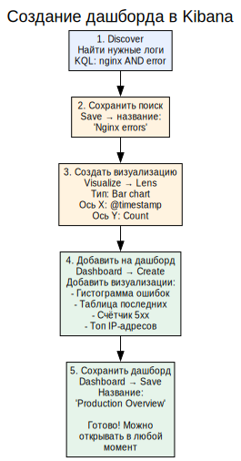
---

### Что означают цвета в гистограмме?

При использовании KQL-запроса гистограмма окрашивается в разные цвета:

| Цвет | Значение | Пример |
|------|----------|--------|
| **Синий** | Все логи (без фильтра) | `*` |
| **Зелёный** | Логи, соответствующие фильтру | `nginx AND 200` |
| **Красный** | Логи, НЕ соответствующие фильтру | `nginx AND error` |
| **Серый** | Пустые интервалы (нет логов) | Сервер был выключен |

Это помогает быстро оценить соотношение "хороших" и "плохих" логов.

---

### Вывод

Kibana — это мощный инструмент для работы с логами. С его помощью можно:

1. **Находить ошибки** за секунды (вместо grep по файлам на разных серверах)
2. **Анализировать тренды** (гистограмма показывает всплески и падения)
3. **Создавать дашборды** для мониторинга в реальном времени
4. **Экспортировать данные** для отчётов
5. **Настраивать алерты** (Watcher) для автоматического оповещения о проблемах

